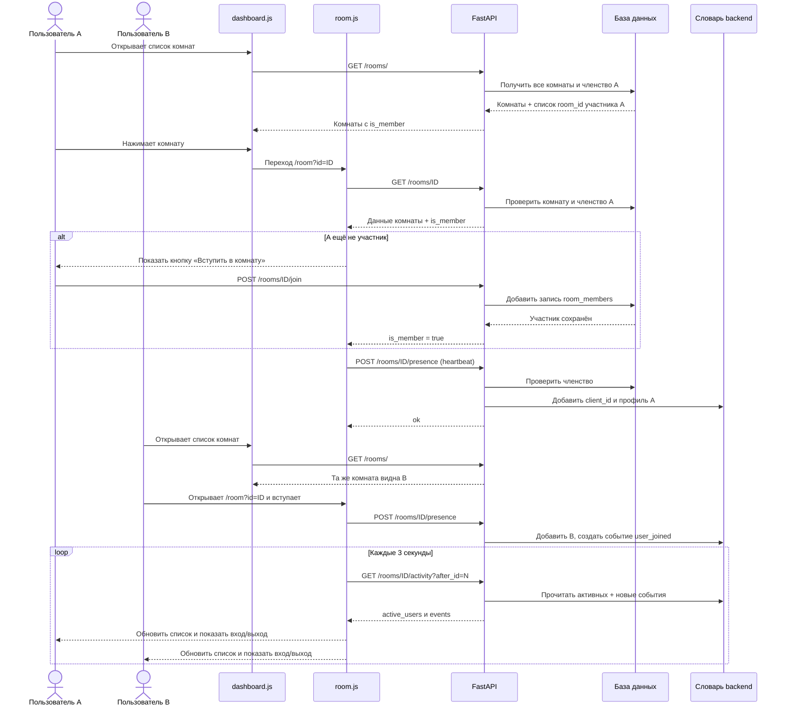
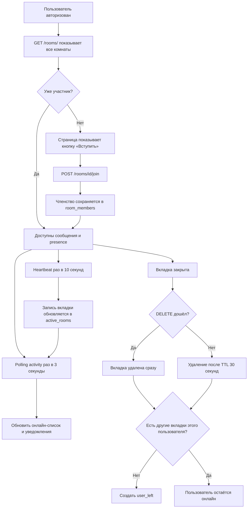

# Как работают комнаты и список онлайн-пользователей

## Коротко

В приложении есть три разных состояния. Они связаны, но не заменяют друг друга:

| Состояние | Где хранится | Что означает |
|---|---|---|
| Комната | Таблица `chat_rooms` в БД | Комната создана и доступна в общем списке |
| Участник комнаты | Таблица `room_members` в БД | Пользователь вступил в комнату и может читать/отправлять сообщения |
| Сейчас онлайн | Словарь `active_rooms` в памяти backend | Пользователь недавно отправлял heartbeat из открытой вкладки комнаты |

Участие сохраняется между перезапусками, онлайн-список — нет. При закрытии страницы приложение старается сразу отправить запрос об уходе. Если браузер не успел его отправить, сервер удалит пользователя после таймаута.

## Общий путь



## 1. Как комнаты становятся видимыми другим

Обработчик `GET /rooms/` в [rooms.py](../backend/api/rooms.py) больше не ограничивает результат только комнатами текущего пользователя. Он:

1. Получает все комнаты из `chat_rooms`.
2. Отдельно получает `room_id`, в которых состоит текущий пользователь.
3. Для каждой комнаты возвращает `is_member: true` или `false`.

В [dashboard.js](../frontend/static/dashboard.js) клик по комнате переводит браузер на отдельную страницу `/room?id=ID`. Именно эта отдельная страница, а не встроенная панель dashboard, является интерфейсом комнаты.

Важно: увидеть комнату в списке ещё не значит быть её участником.

## 2. Как пользователь вступает

При открытии `/room?id=ID` скрипт [room.js](../frontend/static/room.js) запрашивает `GET /rooms/ID`.

- Если `is_member` равен `true`, страница показывает переписку и включает онлайн-статус.
- Если `is_member` равен `false`, показывается кнопка «Вступить в комнату».
- Кнопка вызывает `POST /rooms/ID/join`. Сервер добавляет пару `room_id + user_id` в таблицу `room_members`.

Запрос вступления безопасен при повторе: если пользователь уже участник, сервер не создаёт вторую запись.

После вступления пользователь может читать и отправлять сообщения, а также участвовать в presence. Сервер проверяет членство для этих действий через `_ensure_room_access`. Поэтому простого знания номера комнаты недостаточно.

## 3. Что такое онлайн-пользователь

Участник комнаты может не находиться в ней прямо сейчас. Например, он вступил вчера, закрыл вкладку и остаётся участником в БД. Это нормально:

- `room_members` отвечает на вопрос «кто имеет доступ?»;
- `active_rooms` отвечает на вопрос «кто недавно был активен в этой комнате?».

Backend хранит онлайн-данные в памяти процесса примерно так:

```text
active_rooms[
    room_id
][
    telegram_id
][
    client_id
] = {
    full_name,
    username,
    last_seen
}
```

Пример структуры:

```text
active_rooms = {
    42: {                         # комната 42
        10001: {                  # пользователь с telegram_id 10001
            "вкладка-A": {        # открытая вкладка браузера
                "full_name": "Анна",
                "username": "anna",
                "last_seen": 12345.6
            },
            "вкладка-B": { ... } # вторая вкладка того же пользователя
        },
        10002: {                  # другой пользователь
            "вкладка-C": { ... }
        }
    }
}
```

`client_id` создаётся отдельно для каждой вкладки. Поэтому если один пользователь открыл две вкладки, он отображается в списке один раз. Закрытие одной вкладки не объявляет пользователя вышедшим, пока остаётся другая активная вкладка.

## 4. Heartbeat: как сервер понимает, что вкладка ещё открыта

После открытия комнаты браузер отправляет:

```http
POST /rooms/{room_id}/presence
Authorization: Bearer <access_token>
Content-Type: application/json

{"client_id":"идентификатор-вкладки"}
```

Затем такой запрос повторяется каждые 10 секунд. Это называется heartbeat, то есть сигнал «вкладка всё ещё здесь».

Сервер записывает время последнего сигнала в `last_seen`. При обработке heartbeat сервер:

1. Проверяет JWT и членство пользователя в комнате.
2. Удаляет записи, не обновлявшиеся больше 30 секунд.
3. Обновляет `last_seen` для текущей вкладки.
4. Если у пользователя ещё не было активных вкладок в этой комнате, добавляет событие `user_joined`.

Настройка таймаута находится в `PRESENCE_TTL_SECONDS` в `rooms.py` и сейчас равна 30 секундам.

## 5. Polling: как браузер получает изменения

Браузер сам регулярно спрашивает сервер, изменилось ли состояние. Это и есть polling; сервер не отправляет события браузеру сам.

Каждые 3 секунды страница вызывает:

```http
GET /rooms/{room_id}/activity?after_id={последний_полученный_id}
Authorization: Bearer <access_token>
```

Ответ имеет примерно такой вид:

```json
{
  "active_users": [
    {
      "user_id": 10001,
      "full_name": "Анна Иванова",
      "username": "anna"
    }
  ],
  "events": [
    {
      "id": 18,
      "type": "user_joined",
      "user_id": 10001,
      "full_name": "Анна Иванова",
      "username": "anna"
    }
  ]
}
```

- `active_users` — актуальный снимок списка онлайн. Страница каждый раз заново рисует этот список.
- `events` — события входа и выхода после `after_id`.
- `id` у события — курсор. Браузер запоминает самый большой полученный ID, чтобы при следующем опросе не просить старые события снова.

На первом ответе страница заполняет список онлайн, но не показывает старые события как новые уведомления. Следующие события добавляются в ленту сообщений как «присоединился к комнате» или «покинул комнату».

Сообщения чата страница также проверяет HTTP-запросом примерно каждые 3 секунды. Этот polling отдельный от polling присутствия.

## 6. Как фиксируется выход

При уходе со страницы `room.js` пытается отправить:

```http
DELETE /rooms/{room_id}/presence/{client_id}
Authorization: Bearer <access_token>
```

Сервер удаляет только эту вкладку. Если у пользователя больше не осталось вкладок в комнате, сервер удаляет пользователя из `active_rooms` и создаёт событие `user_left`.

Запрос при закрытии вкладки best-effort: браузер может закрыться раньше, чем запрос дойдёт. На этот случай есть таймаут:

- heartbeat приходит каждые 10 секунд;
- если сигналов нет больше 30 секунд, вкладка считается просроченной;
- при следующем запросе presence/activity сервер удалит её и создаст `user_left`, если других вкладок этого пользователя не осталось.

Таким образом, если браузер не доставил `DELETE`, выход может отобразиться с задержкой примерно до таймаута и следующего polling-запроса.

## Схема состояний



## 7. Как проверить на двух пользователях

1. Запустите backend и войдите в приложение под аккаунтом A.
2. Создайте комнату. Создатель автоматически добавляется в `room_members`.
3. Откройте приложение во втором браузере или отдельном профиле и войдите под аккаунтом B. Нужны именно разные аккаунты: обычное окно и вкладка обычно используют одно и то же хранилище токена.
4. Обновите dashboard аккаунта B. Новая комната должна появиться в общем списке.
5. Откройте её. До вступления должна отображаться кнопка «Вступить в комнату».
6. Нажмите кнопку. Комната покажет сообщения и онлайн-список.
7. Откройте ту же комнату аккаунтом A. После polling оба пользователя должны увидеться в списке.
8. Закройте вкладку B. Событие выхода обычно появится сразу; если браузер не доставил запрос, дождитесь таймаута до 30 секунд и следующего опроса.

Если в окне B видна кнопка вступления, но сообщения не открываются, проверьте ответ `POST /rooms/{id}/join` в Network браузера и затем запрос `GET /rooms/{id}/messages`.

## 8. Ограничения текущей реализации

- `active_rooms` и `room_events` — обычные словари Python. Перезапуск backend очищает онлайн-список и временные события. Список участников не очищается, потому что хранится в БД.
- Словари общие только внутри одного процесса Python. Если запустить несколько workers, у каждого будет свой список онлайн. Тогда понадобится общее хранилище, например Redis.
- Очередь событий комнаты ограничена последними 500 событиями. Это временная лента уведомлений, не история чата.
- Системные уведомления о входе/выходе не сохраняются в таблицу сообщений. После перезагрузки страницы они не появятся в истории.
- Polling проще WebSocket, но регулярно создаёт HTTP-запросы. Сейчас список участников опрашивается каждые 3 секунды, heartbeat отправляется каждые 10 секунд, история сообщений также проверяется каждые 3 секунды.
- Адреса `/rooms/` со слэшем и `/rooms` без него отличаются для FastAPI: вариант без слэша может вернуть `307 Temporary Redirect`. В текущем dashboard используется `/rooms/`.

## Где находится код

- Серверные комнаты, вступление, сообщения и presence: [backend/api/rooms.py](../backend/api/rooms.py)
- Отдельная HTML-страница комнаты: [frontend/room.html](../frontend/room.html)
- Запросы, heartbeat, polling и отображение участников: [frontend/static/room.js](../frontend/static/room.js)
- Список комнат и переход на отдельную страницу: [frontend/static/dashboard.js](../frontend/static/dashboard.js)
