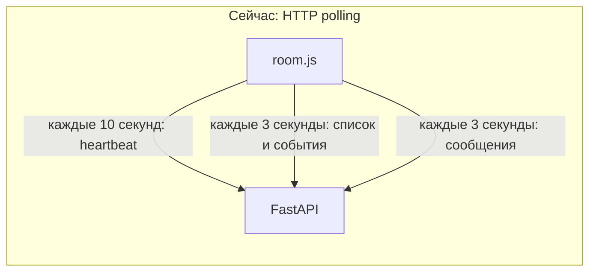
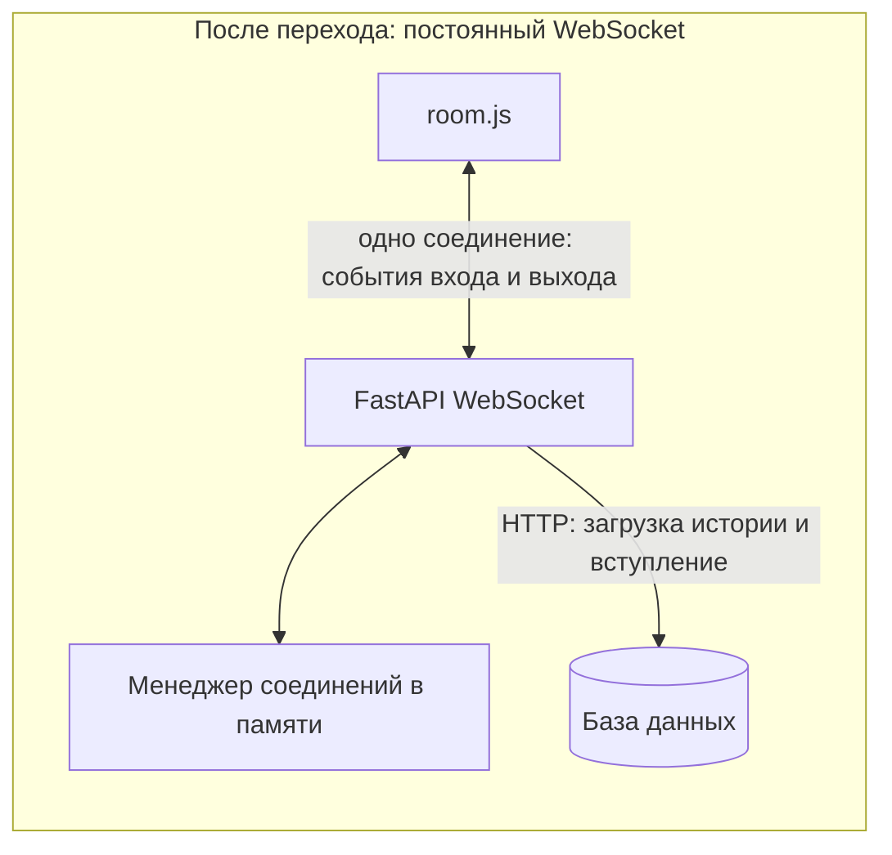
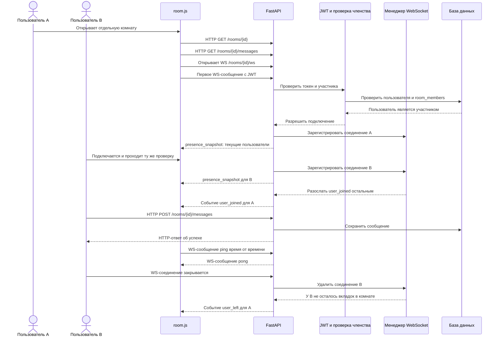

# Переход активности комнат на WebSocket

## Для чего эта инструкция

Сейчас браузер регулярно обращается к серверу по HTTP, чтобы спросить: «Кто сейчас в комнате?» и «Появилось ли что-нибудь новое?». Такой способ называется polling. Он работает, но создает повторные запросы, даже когда ничего не меняется.

WebSocket открывает одно постоянное соединение между вкладкой и сервером. Когда пользователь входит или выходит, сервер сам отправляет событие в это соединение. Для списка онлайн и уведомлений о входе/выходе это удобнее, чем постоянный опрос.

Важно: HTTP сам по себе не является плохой практикой. HTTP хорошо подходит для операций «запросил — получил ответ»: получить список комнат, вступить в комнату, загрузить старую историю. WebSocket особенно полезен там, где сервер должен быстро сообщать браузеру о новых событиях.

Эта инструкция описывает поэтапную замену **presence-механизма**. В первом варианте история и отправка сообщений остаются HTTP-запросами. В конце описан следующий шаг, если вы захотите убрать и polling новых сообщений.

## Как устроено сейчас

В текущем коде:

- комнаты, вступление и HTTP API находятся в [backend/api/rooms.py](../backend/api/rooms.py);
- проверка JWT для HTTP находится в [backend/api/auth.py](../backend/api/auth.py);
- фабрика асинхронных сессий БД находится в [backend/api/database.py](../backend/api/database.py);
- страница отдельной комнаты — [frontend/room.html](../frontend/room.html);
- heartbeat, polling присутствия и отображение событий — [frontend/static/room.js](../frontend/static/room.js).

Сейчас браузер:

1. Отправляет `POST /rooms/{id}/presence` примерно каждые 10 секунд.
2. Запрашивает `GET /rooms/{id}/activity` примерно каждые 3 секунды.
3. Отдельно запрашивает историю сообщений примерно каждые 3 секунды.

При WebSocket браузер подключается один раз. Сервер держит соединение открытым и отправляет события по мере их появления.

## Схема: было и станет





## Итоговый сценарий



# Пошаговая инструкция

## Шаг 1. Решите, что именно переводить на WebSocket

Рекомендуемый первый этап:

- **оставить HTTP** для списка комнат, получения данных комнаты, вступления, загрузки истории и сохранения сообщений;
- **перевести на WebSocket** список активных подключений и уведомления о входе/выходе;
- оставить HTTP polling сообщений временно, если хотите сначала проверить только presence.

Это разделение удобно: база данных по-прежнему отвечает за сохранённые данные, а WebSocket — за быстрые события в открытых комнатах.

Если оставить polling сообщений, запросы для обновления списка онлайн и событий нужно убрать, но запрос сообщений останется. Как полностью убрать и его, описано в последнем разделе.

## Шаг 2. Определите формат сообщений WebSocket

Обычный HTTP-ответ заканчивается после одного ответа. WebSocket-соединение не заканчивается, поэтому стороны договариваются о формате каждого сообщения. Удобно передавать JSON с полем `type`.

Пример сообщения от браузера для авторизации:

```json
{
  "type": "authenticate",
  "token": "JWT_ACCESS_TOKEN"
}
```

Пример начального списка участников от сервера:

```json
{
  "type": "presence_snapshot",
  "users": [
    {
      "user_id": 10001,
      "full_name": "Анна Иванова",
      "username": "anna"
    }
  ]
}
```

Пример события о входе:

```json
{
  "type": "user_joined",
  "user": {
    "user_id": 10002,
    "full_name": "Иван Петров",
    "username": "ivan"
  }
}
```

Пример события о выходе:

```json
{
  "type": "user_left",
  "user": {
    "user_id": 10002,
    "full_name": "Иван Петров",
    "username": "ivan"
  }
}
```

Примеры heartbeat-сообщений:

```json
{"type":"ping"}
```

```json
{"type":"pong"}
```

Единый формат позволяет серверу и браузеру понимать, что означает каждое сообщение, не угадывая его смысл по наличию отдельных полей.

## Шаг 3. Добавьте отдельный менеджер соединений

Создайте новый файл `backend/api/room_connections.py`. Его ответственность — хранить открытые WebSocket-соединения и рассылать события. Не смешивайте эту логику с кодом SQL-запросов.

Для начала менеджер должен уметь:

1. Добавить WebSocket в нужную комнату.
2. Удалить конкретный WebSocket при отключении.
3. Вернуть список пользователей комнаты.
4. Отправить событие всем соединениям комнаты.
5. Исключить новое соединение из события `user_joined`, если не хотите сообщать человеку о его собственном входе.
6. Удалить пустые комнаты из словаря, когда в них больше нет подключений.

Структура для небольшого однопроцессного приложения может быть такой:

```python
# room_id -> user_id -> набор открытых WebSocket-соединений
connections: dict[int, dict[int, set[WebSocket]]] = {}

# room_id -> user_id -> профиль пользователя для списка и уведомлений
profiles: dict[int, dict[int, dict[str, str | int | None]]] = {}
```

Почему здесь набор соединений, а не только `user_id -> WebSocket`? Один человек может открыть одну комнату в нескольких вкладках. Если закрыть одну вкладку, пользователь должен остаться онлайн, пока открыта другая.

Методы менеджера удобно спроектировать примерно так:

```text
connect(room_id, user_id, profile, websocket)
    -> вернуть, был ли пользователь уже онлайн до этого подключения

get_users(room_id)
    -> вернуть список профилей пользователей комнаты

broadcast(room_id, event, exclude=None)
    -> отправить event всем сокетам комнаты, кроме exclude при необходимости

disconnect(room_id, user_id, websocket)
    -> удалить только это соединение и вернуть, ушёл ли пользователь полностью
```

Менеджер хранит только текущие соединения. Сохранять в нём всю историю чата не нужно.

### Правило первого подключения

До добавления соединения проверьте, был ли у пользователя уже хотя бы один WebSocket в этой комнате.

- Если соединений не было, добавьте профиль и после подключения разошлите `user_joined`.
- Если у пользователя уже была другая вкладка, добавьте ещё один WebSocket, но не создавайте второе событие входа.

При первом подключении сервер отправляет новому браузеру `presence_snapshot`. Снимок включает текущих участников; обычно туда включают и самого подключившегося пользователя.

### Правило отключения

При отключении удалите из набора только закрывшийся WebSocket.

- Если у пользователя остались другие WebSocket-соединения, не отправляйте `user_left`.
- Если соединений больше нет, удалите профиль пользователя и разошлите `user_left`.
- Если после этого комната пуста, удалите её запись из словарей.

## Шаг 4. Подготовьте проверку JWT для WebSocket

В HTTP сейчас применяется `get_current_user` из `auth.py`. Он получает JWT из HTTP-заголовка `Authorization`.

Важное отличие: стандартный браузерный `new WebSocket(...)` не позволяет указать произвольный заголовок `Authorization`. Поэтому нельзя просто перенести `fetchWithAuth` на WebSocket.

Для начального варианта браузер отправляет JWT первым JSON-сообщением после открытия сокета. Не добавляйте JWT к URL, например `?token=...`: URL может попасть в access-логи, историю браузера и средства диагностики.

На сервере после получения первого сообщения нужно:

1. Убедиться, что `type` равен `authenticate`.
2. Проверить, что токен присутствует.
3. Раскодировать токен теми же параметрами, что и в `auth.py`: `SECRET_KEY` и `ALGORITHM`.
4. Получить `telegram_id` из поля `sub`.
5. Найти пользователя в БД.
6. Проверить запись `RoomMember` для пары `room_id + telegram_id`.
7. Если любая проверка не прошла, закрыть сокет с кодом политики, например `1008`, и не добавлять его в менеджер.

Псевдокод расшифровки токена:

```python
payload = jwt.decode(
    token,
    settings.SECRET_KEY,
    algorithms=[settings.ALGORITHM],
)
telegram_id = int(payload["sub"])
```

Оберните эту часть обработкой `JWTError`, `KeyError`, `TypeError` и `ValueError`. Неверный токен не должен завершать процесс сервера.

Для подключения к БД используйте `async_session_maker` из `api/database.py` только на время проверки пользователя и членства:

```python
async with async_session_maker() as session:
    # Найти User по telegram_id.
    # Проверить RoomMember для room_id и telegram_id.
    # Сохранить нужные поля профиля в локальные переменные.
    pass

# После выхода из блока сессия БД закрыта.
# Дальше WebSocket может жить долго без открытой DB-сессии.
```

Не держите AsyncSession открытой на всё время WebSocket-соединения. Для соединения, которое может работать часами, DB-сессия должна открываться только на короткие запросы и закрываться сразу.

Для первого учебного варианта допустимо послать access token первым сообщением по `wss://`: содержимое зашифровано TLS и не находится в URL. Не записывайте тело этого сообщения в логи. Более строгий вариант на будущее — выдавать через авторизованный HTTP одноразовый короткоживущий билет на подключение.

## Шаг 5. Добавьте WebSocket endpoint в FastAPI

Добавьте WebSocket-маршрут в `backend/api/rooms.py` или в отдельный модуль маршрутов. Например:

```text
@router.websocket("/{room_id}/ws")
async def room_socket(websocket, room_id):
    принять WebSocket-соединение
    в течение ограниченного времени получить authenticate
    проверить JWT, пользователя, комнату и RoomMember
    зарегистрировать сокет в менеджере
    отправить подключившемуся presence_snapshot
    если пользователь вошёл впервые — сообщить остальным user_joined

    пока соединение открыто:
        получить сообщение браузера
        если это ping — обновить время активности и ответить pong
        иначе — проверить допустимый тип сообщения

    при отключении:
        удалить сокет из менеджера
        если у пользователя не осталось вкладок — отправить user_left
```

`@router.websocket("/{room_id}/ws")` вместе с `router = APIRouter(prefix="/rooms")` создаёт адрес:

```text
/rooms/{room_id}/ws
```

Главный файл уже подключает `rooms_router` через `app.include_router(rooms_router)`, поэтому отдельная регистрация WebSocket-маршрута в `main.py` не нужна, если вы добавляете маршрут к тому же router.

### Обязательно обработайте отключение

Когда вкладка закрывается, FastAPI обычно сообщает об этом исключением `WebSocketDisconnect`. Удаление из менеджера должно находиться в `finally`, чтобы выполняться и при обычном закрытии, и при ошибке:

```text
try:
    принять и обслуживать соединение
except WebSocketDisconnect:
    ничего не считать аварией
finally:
    если пользователь был зарегистрирован:
        удалить его WebSocket из менеджера
        при необходимости отправить user_left
```

Событие `user_left` создавайте после очистки менеджера и только если у пользователя не осталось других вкладок этой комнаты.

### Защитите handshake

- Установите короткое время на получение первого сообщения авторизации, например 5 секунд. Если его нет, закройте соединение.
- Ограничьте типы и размер JSON-сообщений.
- Проверяйте членство в комнате на сервере. Скрытая кнопка в HTML не является проверкой доступа.
- Проверяйте `Origin`, особенно если браузер открывает приложение и API с разных доменов. Для одного origin можно разрешить только ваш домен.
- JWT не должен попадать в URL или обычные информационные логи.

## Шаг 6. Сделайте отправку событий всем участникам

Когда новый пользователь успешно прошёл авторизацию:

1. Получите список пользователей, которые уже подключены.
2. Зарегистрируйте новое соединение.
3. Отправьте новое соединение сообщение `presence_snapshot`.
4. Если это первое соединение данного пользователя в комнате, отправьте всем остальным `user_joined`.

Когда пользователь полностью отключился:

1. Удалите конкретный WebSocket.
2. Проверьте, остались ли у него другие соединения.
3. Если соединений не осталось — удалите профиль и отправьте всем оставшимся `user_left`.

Отправку каждому сокету обрабатывайте отдельно: один закрытый клиент не должен мешать доставке остальным. Если `send_json` завершился ошибкой, пометьте соединение для удаления. При нескольких одновременных рассылках полезно сериализовать отправку в каждый WebSocket отдельной `asyncio.Lock`.

## Шаг 7. Измените клиент `room.js`

Вместо `fetch` для WebSocket создаётся объект `WebSocket`. Используйте протокол страницы автоматически:

```javascript
function createRoomSocket(roomId) {
    const protocol = window.location.protocol === "https:" ? "wss:" : "ws:";
    const url = `${protocol}//${window.location.host}/rooms/${roomId}/ws`;
    const socket = new WebSocket(url);

    socket.addEventListener("open", () => {
        socket.send(JSON.stringify({
            type: "authenticate",
            token: getToken(),
        }));
    });

    socket.addEventListener("message", event => {
        const message = JSON.parse(event.data);

        if (message.type === "presence_snapshot") {
            renderActiveUsers(message.users);
        } else if (message.type === "user_joined") {
            addActiveUser(message.user);
            appendPresenceNotice(message);
        } else if (message.type === "user_left") {
            removeActiveUser(message.user.user_id);
            appendPresenceNotice(message);
        } else if (message.type === "pong") {
            // Сервер подтвердил heartbeat.
        }
    });

    socket.addEventListener("close", event => {
        // Показать состояние «соединение потеряно».
        // При необходимости запланировать повторное подключение.
    });

    socket.addEventListener("error", () => {
        // Показать понятное сообщение, не выводить JWT в лог.
    });

    return socket;
}
```

Функции `renderActiveUsers`, `appendPresenceNotice` у вас уже есть в `room.js`. Нужно добавить или адаптировать `addActiveUser` и `removeActiveUser` так, чтобы список менялся по событиям, а не перерисовывался polling-запросом.

После успешного HTTP-запроса загрузки комнаты и проверки `is_member` вызовите `createRoomSocket(roomId)`. Не подключайте сокет до проверки членства: сервер всё равно обязан выполнить эту проверку, но так интерфейс не будет создавать заведомо лишнее соединение.

### Обработка закрытия комнаты

Сохраните объект сокета в переменную, например `let roomSocket = null`. При уходе со страницы:

```javascript
window.addEventListener("pagehide", () => {
    if (roomSocket && roomSocket.readyState === WebSocket.OPEN) {
        roomSocket.close(1000, "room page closed");
    }
});
```

Закрытие вкладки — только сигнал клиентской стороны. Сервер всё равно обязан очищать соединение в `finally`, потому что браузер или сеть могут оборвать связь без аккуратного close-frame.

Если страница возвращается из browser back-forward cache, её старый WebSocket уже закрыт. В обработчике `pageshow` с `event.persisted === true` нужно создать новое соединение. Не создавайте второй сокет при обычном первом открытии страницы.

### Автоматическое переподключение

Сеть может временно пропасть. В обработчике `close` можно планировать повторное подключение с увеличивающейся паузой, например 1, 2, 4, 8 секунд, но ограничить максимумом 30 секунд. После переподключения снова отправляется `authenticate`, сервер заново проверяет членство и присылает новый `presence_snapshot`.

Не запускайте несколько таймеров переподключения одновременно. Храните один timer ID и очищайте его при успешном открытии сокета или уходе со страницы.

## Шаг 8. Уберите старый polling присутствия

Когда WebSocket-путь проверен, удалите из `room.js`:

- вызов `sendPresenceHeartbeat()` и его `setInterval`;
- повторный вызов `pollRoomActivity()` через `setTimeout`;
- запрос `GET /rooms/{id}/activity`;
- HTTP `DELETE /rooms/{id}/presence/{client_id}` из `pagehide`.

На сервере после этого можно удалить старые REST-маршруты presence и связанные только с polling структуры:

- `POST /rooms/{id}/presence`;
- `DELETE /rooms/{id}/presence/{client_id}`;
- `GET /rooms/{id}/activity`;
- `room_events`, `next_presence_event_id`, `PRESENCE_TTL_SECONDS` и старую структуру `active_rooms`.

Удаляйте старый код только после проверки WebSocket, иначе получится состояние, когда браузер уже перестал делать polling, а WebSocket ещё не работает.

HTTP-эндпоинты `GET /rooms/{id}/messages` и `POST /rooms/{id}/messages` на первом этапе оставьте: они загружают сохранённые сообщения и записывают новое в БД.

## Шаг 9. Решите, как будут обновляться сами сообщения

Вариант A — WebSocket только для присутствия:

- список пользователей и уведомления о входе/выходе идут через WebSocket;
- история загружается HTTP-запросом;
- новые сообщения другие пользователи увидят только благодаря текущему polling сообщений.

Вариант B — сообщения тоже идут через WebSocket:

1. Браузер отправляет по сокету JSON вида `{"type":"send_message","text":"Привет"}`.
2. Сервер проверяет, что сокет аутентифицирован и состоит в комнате.
3. Сервер сохраняет сообщение в таблицу `messages` через короткую DB-сессию.
4. После успешного commit сервер рассылает всем участникам событие `new_message` с `id`, `room_id`, `user_id`, именем автора, текстом и временем.
5. Браузер отображает `new_message` сразу.
6. После проверки этого сценария можно убрать polling новых сообщений; HTTP GET истории остаётся для первого открытия страницы.

Не показывайте сообщение другим пользователям до успешного сохранения в БД. Иначе интерфейс может показать сообщение, которое сервер не смог записать.

## Шаг 10. Проверьте работу

Используйте два разных аккаунта. Например, обычное окно браузера и приватное окно, чтобы в них были разные access token.

1. Запустите backend на одном процессе.
2. Войдите аккаунтом A и создайте комнату.
3. Войдите аккаунтом B, откройте эту комнату и вступите в неё.
4. Откройте DevTools браузера: вкладка Network, фильтр WS.
5. Убедитесь, что соединение `/rooms/{id}/ws` открылось и статус handshake — `101 Switching Protocols`.
6. В сообщениях WebSocket проверьте порядок: сначала `authenticate`, после проверки — `presence_snapshot`.
7. Откройте комнату вторым аккаунтом. Первый должен получить `user_joined` без обновления страницы.
8. Закройте комнату второго аккаунта. Первый должен получить `user_left`.
9. Откройте комнату вторым аккаунтом в двух вкладках. Закройте только одну: пользователь должен оставаться онлайн. Закройте обе: должен появиться `user_left`.
10. Откройте комнату неучастником. Сервер не должен допустить его до списка участников или событий комнаты.
11. Отключите интернет на короткое время и проверьте состояние закрытия и повторного подключения.

Для ручной диагностики:

| Симптом | Что проверить |
|---|---|
| В Network нет WS-запроса | Клиент дошёл ли до `createRoomSocket` после проверки `is_member` |
| Ошибка сразу после открытия | Сервер получил ли первое JSON-сообщение `authenticate` |
| Сокет открылся, потом закрылся с 1008 | JWT, срок его действия и запись `RoomMember` |
| `user_joined` получает только новый пользователь | После регистрации сервер не рассылает событие другим сокетам комнаты |
| `user_left` появляется при закрытии одной из двух вкладок | Сервер проверяет число соединений пользователя до отправки события |
| При HTTPS сообщение Mixed Content | Клиент использует `wss://`, а не `ws://` |
| Uvicorn пишет `Invalid HTTP request` | На локальный HTTP-порт может приходить TLS напрямую; forwarded HTTPS снаружи обычно должен завершаться на прокси, а к Uvicorn идти как HTTP |

## Порт forwarding в VS Code и HTTPS

Если страница открыта по HTTPS через перенаправленный порт VS Code, браузер требует защищённый WebSocket `wss://`. Код выше выбирает `wss:` автоматически для HTTPS-страницы и `ws:` для локальной HTTP-страницы.

При обычном port forwarding TLS обычно завершается на внешнем адресе forwarding, а локальный Uvicorn продолжает обслуживать HTTP на `8000`. Не включайте TLS в Uvicorn только потому, что ссылка в браузере начинается с `https://`. Важно, чтобы WebSocket-запрос строился от того же forwarded host, на котором открыта страница.

## Ограничения хранения в памяти

Менеджер соединений в словаре Python подходит для локальной разработки и одного backend-процесса.

- Перезапуск процесса закроет все WebSocket-соединения; браузеры должны подключиться заново.
- Если запущено несколько workers или несколько серверов, соединения распределены между процессами. Событие, полученное одним процессом, не попадёт в другой.
- Для нескольких процессов позже понадобится общий pub/sub, например Redis. Сам список открытых WebSocket всё равно останется локальным для каждого процесса, а Redis будет передавать события между ними.

Не запускайте Uvicorn с несколькими workers, пока менеджер соединений хранится только в памяти одного процесса.

## Что именно меняется относительно текущего кода

| Сейчас | После миграции presence |
|---|---|
| `POST /rooms/{id}/presence` раз в 10 секунд | Одно WebSocket-соединение на открытую вкладку |
| `GET /rooms/{id}/activity` раз в 3 секунды | Сервер отправляет события `user_joined` и `user_left` сам |
| `active_rooms` содержит вкладки и `last_seen` | Менеджер содержит живые WebSocket-соединения |
| `room_events` хранит очередь событий для polling | Очередь событий для presence не нужна, событие сразу отправляется подключённым клиентам |
| Выход ловится через DELETE или TTL | Выход очищается в `finally` после disconnect |
| История и отправка сообщений по HTTP | Остаются по HTTP на первом этапе, затем при желании отправка переводится на WebSocket |
